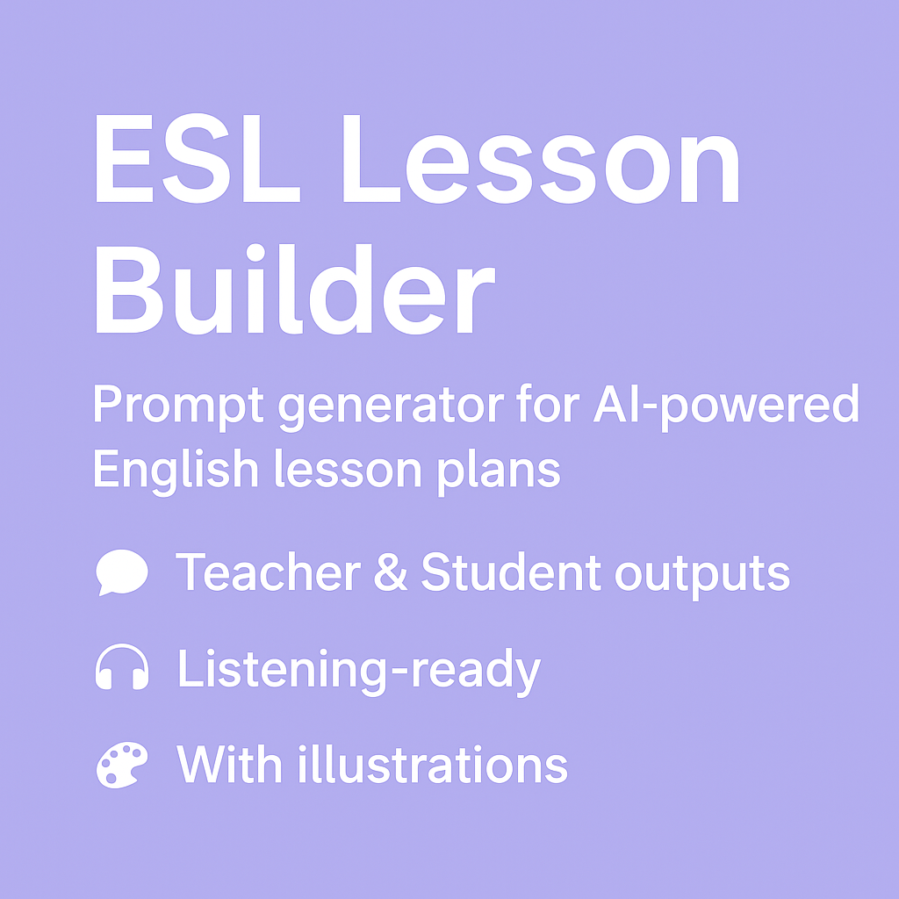

README.md

# ESL Lesson Builder

🛠️ Prompt created by **Abner Carvalho**  
📁 GitHub: [Johnny-armless](https://github.com/Johnny-armless)

This tool generates fully structured English lesson plans using AI.  
It supports both **Teacher** and **Student** versions and includes:

- 💬 Teacher & Student outputs  
- 🎧 Listening-ready lessons  
- 🎨 Two illustrations per lesson

---

## 📦 How it Works

1. Paste the prompt into ChatGPT (GPT-4 preferred).
2. Follow the questions (language, level, topic, grammar...).
3. The AI generates:
   - A `.docx` Teacher plan
   - A `.docx` Student version with two images
4. You generate the listening audio manually using:
   - [ElevenLabs](https://www.elevenlabs.io/)
   - [Kapwing](https://www.kapwing.com/)

---

## ⚠️ What if something is missing?

Sometimes the AI may forget to include:
- The audio dialogue for listening tasks
- One or both illustrations
- The full vocabulary list

💡 In these cases, you can manually ask:

- “Did you generate the dialogue?”  
- “Can you give me the listening text?”  
- “Please generate the images for this lesson.”  
- “You forgot the grammar explanation.”

👉 These quick prompts will help recover what was skipped. Don’t hesitate to ask!

---

## 📁 Files

- `ESL_Lesson_Builder_Prompt.md` – the full prompt  
- `example_output.md` – one full example  
- `LICENSE` – MIT License  
- `banner.png` – visual for the repo

---

## 🎓 Who Is It For?

- English teachers  
- Prompt engineers  
- Content creators  
- ESL startups